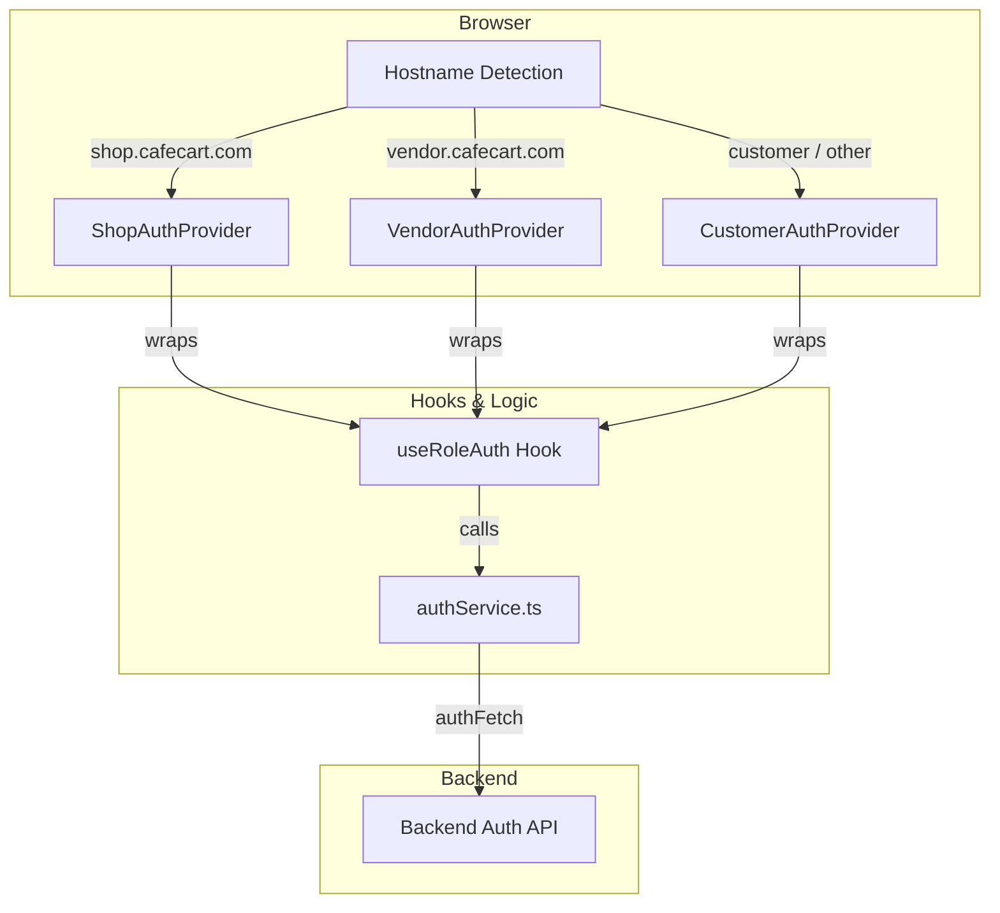

# CafeCart Authentication Architecture

This document describes the multi-role authentication system implemented in CafeCart. The system is designed to allow concurrent sessions for different roles (Customer, Shop, Vendor, Admin) across different subdomains.

## 1. High-Level Overview

The architecture follows a layered approach:
1.  **Detection Layer**: `App.tsx` identifies the user's role based on the hostname.
2.  **Context Layer**: Specific AuthProviders (`ShopAuthProvider`, etc.) manage role-specific state.
3.  **Logic Layer**: `useRoleAuth` hook provides standardized auth behaviors (login, logout, refresh).
4.  **Service Layer**: `authService.ts` handles API communication and is role-aware via `authFetch`.



---

## 2. Role Detection & Protected Routes (`App.tsx`)

Detection is performed at the entry point of the application. The `ActiveApp` component switches the entire application layout and its corresponding provider based on `window.location.hostname`.

### Protected Route Loading
To support session recovery from cookies, the `ProtectedRoute` components are **loading-aware**. On page refresh, when memory is empty, the routes will render `null` while the background auth check is in progress, preventing premature redirects to `/login`.

---

## 3. The Shared Hook (`useRoleAuth.ts`)

To avoid duplicating session management logic, all authentication behaviors are centralized in the `useRoleAuth` hook. 

**Key Responsibilities:**
*   **State Management**: Tracks `token`, `loading`, `error`, and `isAuthenticated`.
*   **Session Recovery**: On mount, it triggers an async check. If no token is in memory (e.g., after a refresh), it relies on the Backend to validate via HTTP-only cookies.
*   **Login Flow**: Executes the login API and persists the token in memory.
*   **Logout Flow**: Clears roles-specific storage and redirects to the login route.

---

## 4. In-Memory Service Layer (`authService.ts`)

The service layer handles the core API communication and token persistence.

### In-Memory Storage (Security)
Tokens are stored in a private `memoryStore` object. This provides high-grade security against XSS attacks, as the tokens are not accessible via `localStorage` or `sessionStorage`.
*   `token`: Customer
*   `shopToken`: Shop
*   `vendorToken`: Vendor
*   `adminToken`: Admin

### Session Recovery Logic
The `checkAuthenticated` helper manages the recovery flow:
1.  **Check Memory**: If a token exists, validate it.
2.  **Silent Refresh**: If memory is empty, attempt to call the **role-specific refresh endpoint** (e.g., `/auth/refresh-token/shop`). The browser automatically sends the corresponding unique cookie (e.g., `shop_refreshToken`).
3.  **Update Memory**: If the refresh is successful, the new access token is saved back into the `memoryStore`.

### `authFetch` & Role Awareness
The `authFetch` helper is the primary tool for authenticated requests. It is **hostname-aware**, meaning it automatically detects which token to attach to the `Authorization` header and which refresh logic to use if the request returns a 401.

```typescript
// Detects active role based on current domain
const getCurrentRoleHelpers = () => {
  const hostname = window.location.hostname;
  if (hostname.includes("shop")) return { get: getShopToken, refresh: refreshTokenShop };
  // ... other roles
};
```

---

## 5. Usage in Components

Components use role-specific hooks to access auth state. This makes it impossible for a developer to accidentally use the "Customer" auth state inside the "Shop" dashboard.

```typescript
// Inside a Shop component
const { shopToken, isShopAuthenticated, logout } = useShopAuth();

// Inside a Customer component
const { token, isAuthenticated, logout } = useCustomerAuth();
```

---

---

## 6. Security & Best Practices

1.  **Concurrent Sessions**: Users can be logged in as a Shop Manager and a Customer simultaneously in different tabs/subdomains.
2.  **Targeted Logout**: Logging out of the Shop subdomain only clears the `shopToken`, leaving other sessions intact.
3.  **Automatic Refresh**: The system handles silent token refreshing via `authFetch`, automatically using the correct endpoint for the current role.
4.  **Error Handling**: Centralized error logic in `useRoleAuth` ensures consistent feedback (e.g., "Link expired", "Incorrect credentials") across all login forms.

---

## 7. Lessons Learned: The Token Leakage Bug

During development, we encountered a bug where logging in as a Shop would unexpectedly create a `token` (Customer) key in LocalStorage alongside the `shopToken`.

### The Cause
The `authFetch` utility in `authService.ts` was originally hardcoded to use `getAuthToken()` and the `refreshToken()` (Customer) function for all requests. Even if a user was on the Shop subdomain, any background API call or failed refresh attempt would use the Customer-specific constants, leading to the creation of the `token` key.

### The Resolution: Role-Aware Fetching
We introduced `getCurrentRoleHelpers()` in `authService.ts`. This utility detects the active role based on the window's hostname. `authFetch` now uses this helper to dynamically select the correct token key and refresh endpoint. 

This change fixed the leakage and enabled stable concurrent sessions across different roles.
